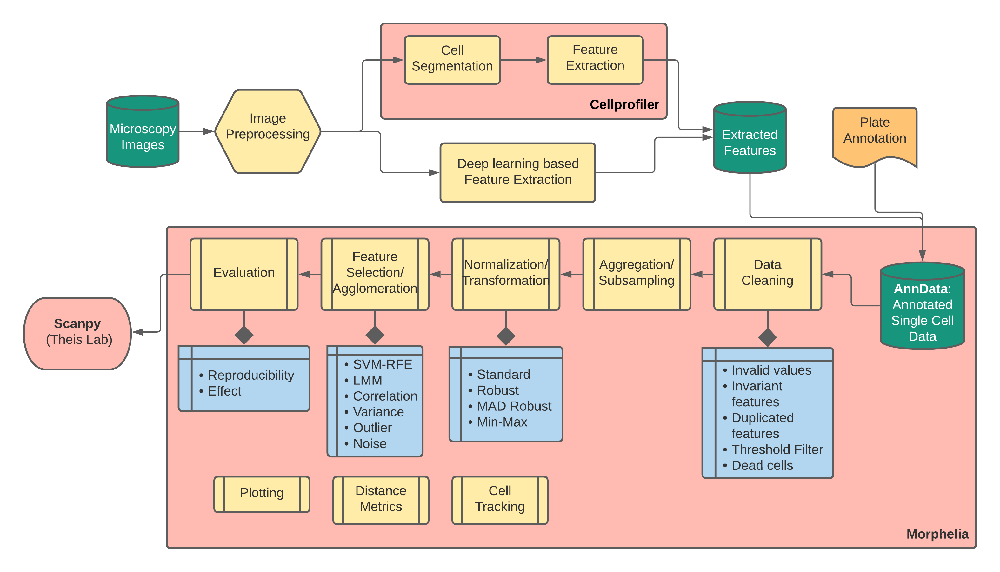

# Morphelia: A collection of functions for exploratory data analysis for image-based morphological profiling

Morphelia aims to provide useful functions that cover commonly used steps in pipelines for
exploratory data analysis, including data preprocessing, feature selection, aggregation
and evaluation. In addition, Morphelia provides functions for data from time-series experiments,
such as cell tracking and dynamic time warping distance metrics.
Morphelia was originally developed to process multivariate outputs from Cellprofiler workflows, 
but can also be used for other multivariate analyses.

In order to integrate with other commonly used single-cell pipelines and to provide a high level
of documentation, Morphelia uses AnnData as underlying data format. This allows annotations to
be clearly separated from learnable features and to use Scanpy functions for single
cell analysis. AnnData and Scanpy were developed by Theis Lab (see References).

### References
* Most methods were implemented based on this review by 20 laboratories worldwide
  where recommended techniques are provided
  
  * Caicedo, J., Cooper, S., Heigwer, F. et al. Data-analysis strategies for image-based cell profiling. 
    Nat Methods 14, 849–863 (2017). https://doi.org/10.1038/nmeth.4397
* [AnnData](https://github.com/theislab/anndata)
* [Scanpy](https://github.com/theislab/scanpy)
    * Wolf, F., Angerer, P. & Theis, F. SCANPY: large-scale single-cell gene expression data analysis. 
      Genome Biol 19, 15 (2018). https://doi.org/10.1186/s13059-017-1382-0
      
* Dynamic Time Warping for multivariate data was achieved with methods developed by
the DTAI Research Group
  
  * Shokoohi-Yekta, M., Hu, B., Jin, H. et al. Generalizing DTW to the multi-dimensional case requires an adaptive approach. 
  Data Min Knowl Disc 31, 1–31 (2017). https://doi.org/10.1007/s10618-016-0455-0 