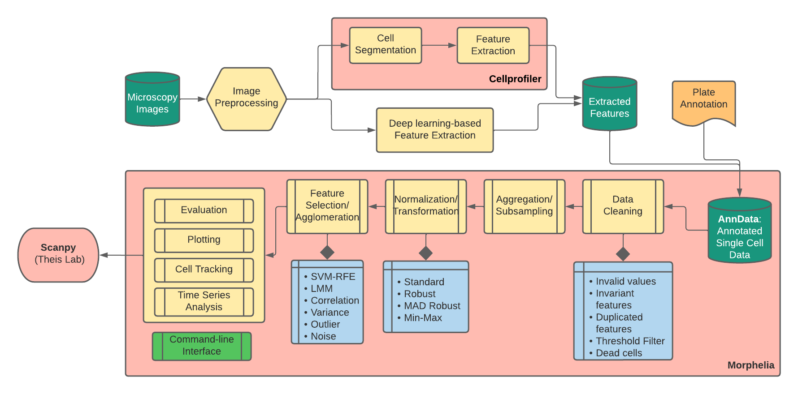

# Morphelia: A data analysis toolkit for image-based morphological profiling

[](https://morphelia.readthedocs.io/en/latest/?badge=latest)
[](https://github.com/psf/black)


Morphelia covers common steps in exploratory data analysis pipelines,
including data preprocessing, feature selection, aggregation
and evaluation. In addition, Morphelia provides tools for multivariate time-series data,
such as cell tracking and dynamic time warping.
Morphelia was originally developed to process multivariate outputs from Cellprofiler workflows,
but can also be used for other multivariate analyses.

In order to integrate with the popular [Scanpy](https://github.com/theislab/scanpy) ecosystem,
Morphelia uses [AnnData](https://github.com/theislab/anndata) as underlying data format.





## Installation

Clone the repository.

```
cd /your/path
git clone https://github.com/marx-alex/Morphelia
```

Create a new Conda environment.

```
conda env create -f morphelia.yml -n morphelia
conda activate morphelia
```

Install morphelia.

```
python -m pip install .
```


## References
This package started as a one-in-all solution for image-based profiling methods described here:
  * Caicedo, J., Cooper, S., Heigwer, F. et al. Data-analysis strategies for image-based cell profiling.
    Nat Methods 14, 849–863 (2017). https://doi.org/10.1038/nmeth.4397
